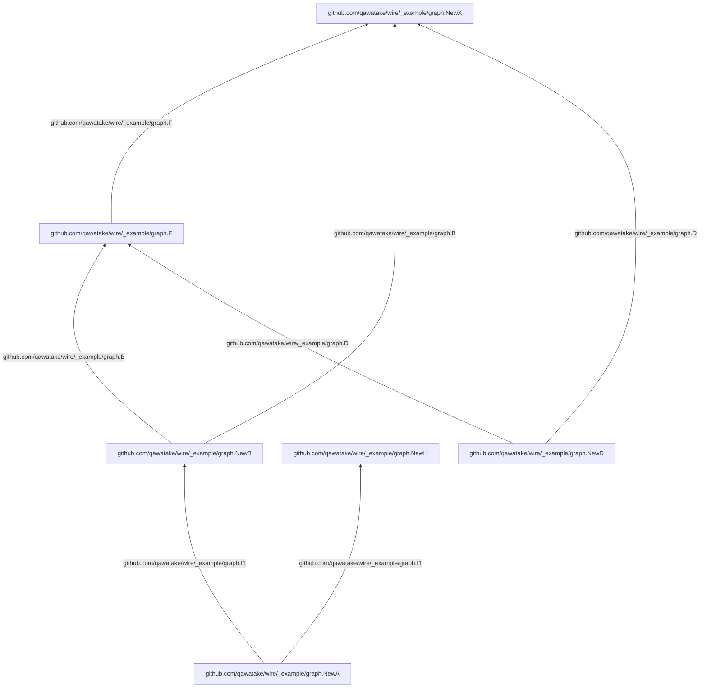

# wire graph

```sh
wire graph -injector initializeX
```


```mermaid
%%{init:{'theme':'default','flowchart':{'rankSpacing':500}}}%%
flowchart BT;
	 0["github.com/qawatake/wire/_example/graph.F"] -- "github.com/qawatake/wire/_example/graph.F" --> 1["github.com/qawatake/wire/_example/graph.NewX"];
	 2["github.com/qawatake/wire/_example/graph.NewA"] -- "github.com/qawatake/wire/_example/graph.I1" --> 3["github.com/qawatake/wire/_example/graph.NewB"];
	 2["github.com/qawatake/wire/_example/graph.NewA"] -- "github.com/qawatake/wire/_example/graph.I1" --> 4["github.com/qawatake/wire/_example/graph.NewH"];
	 3["github.com/qawatake/wire/_example/graph.NewB"] -- "github.com/qawatake/wire/_example/graph.B" --> 0["github.com/qawatake/wire/_example/graph.F"];
	 3["github.com/qawatake/wire/_example/graph.NewB"] -- "github.com/qawatake/wire/_example/graph.B" --> 1["github.com/qawatake/wire/_example/graph.NewX"];
	 5["github.com/qawatake/wire/_example/graph.NewD"] -- "github.com/qawatake/wire/_example/graph.D" --> 0["github.com/qawatake/wire/_example/graph.F"];
	 5["github.com/qawatake/wire/_example/graph.NewD"] -- "github.com/qawatake/wire/_example/graph.D" --> 1["github.com/qawatake/wire/_example/graph.NewX"];
```
