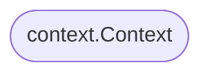

# wire graph

```sh
wire graph -injector initializeX -trim_prefixes github.com/qawatake/wire/_example/graph.
```

Generated graph.


Raw output.

```
flowchart BT;
	 0(["context.Context"]) -- "context.Context" --> 1["NewA"];
	 2[["E"]] -- "E" --> 3{{"F"}};
	 2[["E"]] -- "E" --> 4["NewH"];
	 3{{"F"}} -- "F" --> 5["NewX"];
	 6("H.G") -- "G" --> 5["NewX"];
	 7[["I2"]] -- "I2" --> 8["NewD"];
	 1["NewA"] -- "I1" --> 9["NewB"];
	 1["NewA"] -- "A" --> 4["NewH"];
	 9["NewB"] -- "B" --> 3{{"F"}};
	 9["NewB"] -- "B" --> 5["NewX"];
	 8["NewD"] -- "D" --> 3{{"F"}};
	 8["NewD"] -- "D" --> 5["NewX"];
	 4["NewH"] -- "H" --> 6("H.G");
```

## Node shapes

### Function Provider

```go
NewX
```


### Struct Provider

```go
wire.Struct(new(F), "*")
```


### Value Provider

```go
wire.Value(E{})
wire.InterfaceValue(new(I2), C{})
```


### Field Provider

```go
wire.FieldsOf(new(H), "G")
```


### Injector Argument

```go
func initializeX(context.Context) X {
	panic(wire.Build(Set))
}
```


